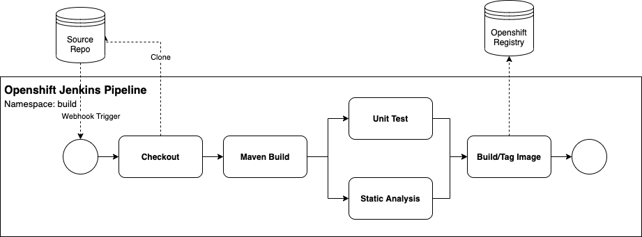

# SDGESI Continuous Integration and Delivery

This repository contains templates and scripts for the creation and management of SDGESI CI/CD pipeline
and deployments.

## Jenkins Pipeline
Below is the Jenkins Pipeline flow that is intended to be instantiated in Openshift.  A Webhook will trigger the pipeline, which will Build, Test, Tag and Push the container image to the Internal Openshift Registry.  This [Jenkinsfile](Jenkinsfile) pipeline definition will be referenced by the [sdgesi-boot-pipeline-template.yaml](templates/sdgesi-boot-pipeline-template.yaml) in the Pipeline Template.



## Pipeline Template

The [sdgesi-boot-pipeline-template.yaml](templates/sdgesi-boot-pipeline-template.yaml) is a template that will
help bootstrap the creation of a Jenkins Pipeline in Openshift.

The template will create three resources in Openshift:

1. Pipeline BuildConfig
1. Image BuildConfig
1. ImageStream

The Pipeline BuildConfig will instantiate a Jenkins Pipeline build that will reference a provided Jenkinsfile located in a Git Repository which will ultimately build an ImageStream using the Image BuildConfig.

The reference [Jenkinsfile](Jenkinsfile) is part fo this repository and can be view [here](Jenkinsfile).

The template favors `Convention over Configuration` and so in most cases you will only need to override two of the parameters: NAME (required) and SOURCE_REPO_URL.  The JENKINS_REPO_URL and associated parameters are also important, but should be a default specified in the template version itself and link to a static version of the Jenkinsfile located in Git (e.g. using Raw with a tag version or ref).

>This template utilizes access to a Git Source Repository to pull the referenced Jenkinsfile and Application Source Code.  For private repositories, which will be the case 99% of the time, a 'source secret' will be need to access the repository.  Best practices here would be to use SSH key or Deploy Keys.  The former is already setup in the master-ocp-l.sempra.com Lab Openshift Cluster.  By convention, this template assumes Secret named 'gitlab' exists.  This can be overriden with the SOURCE_SECRET and JENKINS_SOURCE_SECRET parameters.

**Creating a pipeline definition from the Openshift template**:
```
oc process -f sdgesi-boot-pipeline-template.yaml -p NAME=sdgesi-spring-boot-fuse -p SOURCE_REPO_URL=https://aplsiscmp001.sempra.com/lgirton/sdgesi-spring-boot-fuse.git | oc create -f - -n build
```
Output:
```
imagestream.image.openshift.io/sdgesi-spring-boot-fuse created
buildconfig.build.openshift.io/sdgesi-spring-boot-fuse created
buildconfig.build.openshift.io/sdgesi-spring-boot-fuse-pipeline created
```

This will create the 3 Openshift resources and the pipeline will automatically start the pipeline.  In keeping with GitOps practices, you could commit the output of the `oc process` command to Git repository used to manage active deployments.

```
git clone <DEPLOY_REPO>

cd <DEPLOY_REPO>

oc process -f <TEMPLATE_REPO>/templates/sdgesi-boot-pipeline-template.yaml -n build -p NAME=sdgesi-spring-boot-fuse -p SOURCE_REPO_URL=ssh://git@aplsiscmp001:2222/lgirton/sdgesi-spring-boot-fuse.git > pipeline-sdgesi-spring-boot-fuse.yaml

oc create -f pipeline-sdgesi-spring-boot-fuse.yaml

git commit .

git push -u origin master
```

The template can also be installed in the Openshift namespace where the pipelines will be managed so that it's visible in the OpenShift Service Catalog:

**Installing template in Openshift**
```
oc create -f https://aplsiscmp001.sempra.com/sdgesi/cicd/templates/sdgesi-boot-pipeline-template.yaml -n build
```

### Parameters
As mentioned earlier, the template favors `Convention` over `Configuration` and so there are sensible defaults for most of the parameters and in most cases you will only need to provide the NAME and SOURCE_REPO_URL parameters to the template.

To view all of the parameters of the template:

```sh
oc process -f https://aplsiscmp001.sempra.com/sdgesi/cicd/templates/sdgesi-boot-pipeline-template.yaml --parameters
```

## Deployment Template

The services/applications that are provided by the SDGESI team are consistently the same, especially
when viewed from the perspective of containerization.  They are Java spring boot applications and there
are consistent ports exposed and configuration entry points.  The [sdgesi-boot-deployment-template.yaml](templates/sdgesi-boot-deployment-template.yaml) provides an opinionated view of how these services/applications are composed and deployed.

The items deployed as part of the template are:
* DeploymentConfig
* ConfigMap
* Service
* Route


```
oc process -f https://aplsiscmp001.sempra.com/sdgesi/cicd/templates/sdgesi-boot-deployment-template.yaml -p NAME=sdgesi-spring-boot-fuse -p IMAGE=sdgesi-spring-boot-fuse:latest

```


